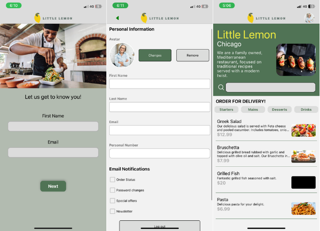

# 🍋 Little Lemon App

A mobile app for a Mediterranean restaurant, built with **React Native + Expo**, using **SQLite** for offline data storage.



## ✨ Features

- 📝 Onboarding screen (name + email)
- 📋 Home screen with full menu (from API)
- 🧠 Filter by category: Starters, Mains, Desserts, Drinks
- 💾 Local database with SQLite
- 👤 Profile screen with user settings
- 📱 Responsive layout & vector icons

Here’s your updated and polished **🚧 Upcoming Features** section with an added item for publishing your app to the stores:

## 🚧 Upcoming Features

* 🔍 **Search by keyword**
  Allow users to search through the menu or content using typed keywords.

* ⏳ **Loading screen on Home**
  Show a loading indicator or splash while images and data are being fetched.

* 🔐 **User authentication system**
  Add sign-up, login, and secure session handling using Firebase, Supabase, or custom backend.

* 📦 **Publish to Google Play & App Store**
  Use **EAS Build** and **EAS Submit** to generate production-ready APK and IPA files and publish them to app marketplaces for wider public access.


## ▶️ Getting Started

- Donwload the 'Expo Go' app.
- Scan the following QR code to preview this update:


[Link](https://expo.dev/preview/update?message=%20end%20project%202&updateRuntimeVersion=1.0.0&createdAt=2025-06-26T15%3A30%3A12.343Z&slug=exp&projectId=990db8ea-645e-4f1d-ae6f-d1223e75ff80&group=fda8048a-a8ae-4339-9f24-b25850892a1f)

## 📂 Structure

```
/assets         → Images (menu, profile, hero)
App.js          → Main navigator
/screens        → Onboarding, Home, Profile
```

## 🧑‍💻 Author

Made by [Angel Chaico](https://github.com/angelchaico).


