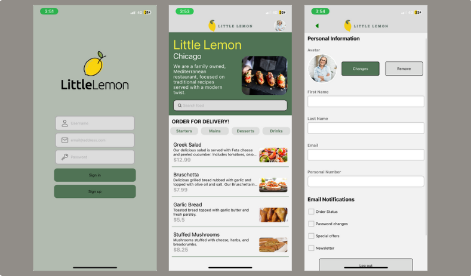

# 🍋 Little Lemon App

A mobile app for a Mediterranean restaurant, built with **React Native + Expo**, using **SQLite** for offline data storage.



## ✨ Features

- 📝 Onboarding screen (name + email)
- 📋 Home screen with full menu (from API)
- 🧠 Filter by category: Starters, Mains, Desserts, Drinks
- 💾 Local database with SQLite
- 👤 Profile screen with user settings
- 📱 Responsive layout & vector icons

## 🚧 Upcoming Features

- 🔍 **Search by keyword**
- ⏳ **Loading screen** on Home (image loading delay)
- 🔐 **User authentication system**

## ▶️ Getting Started

```bash
git clone https://github.com/your-username/little-lemon-app.git
cd little-lemon-app
npm install
npx expo start
````

## 📂 Structure

```
/assets         → Images (menu, profile, hero)
App.js          → Main navigator
/screens        → Onboarding, Home, Profile
```

## 🧑‍💻 Author

Made by [Angel Chaico](https://github.com/angelchaico).


